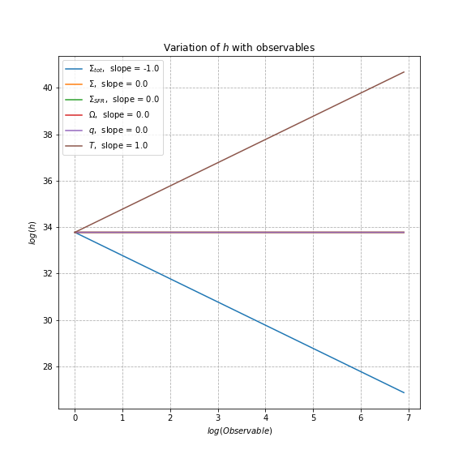

<style>
  .button {
    display: inline-block;
    background-color: #4CAF50;
    color: white;
    padding: 14px 20px;
    text-align: center;
    text-decoration: none;
    border-radius: 4px;
    margin-right: 10px;
    font-size: 16px;
    transition: background-color 0.3s ease;
  }

  .button:hover {
    background-color: #45a049;
  }
</style>
# Scaling Relations Finder
A general framework to find the scaling relations between magnetic field properties and observables for a model of galactic magnetic fields
### Libraries Used
* sympy
* matplotlib
* ipywidgets
## Code Overview
Mean and random components of the magnetic field are modelled based on the following observables:


The turbulence and magnetic field models are solved in the [jupyter notebook](https://github.com/Rnazx/Scaling-Relations/blob/master/scaling_relations.ipynb). Different regimes of the model can be chosen in the notebook from the python widgets. 
* The model for the scale height is inpired by [Forbes et. al. (2012)](https://ui.adsabs.harvard.edu/abs/2012ApJ...754...48F/abstract) is given by
```math
  h= \frac{\zeta w^2}{3\pi G \Sigma_{tot}},
```
where $1\lesssim\zeta\lesssim20$ is a parameter and $w=\max(u,c_\mathrm{s})$.
An alternative model is also included where 
```math
  h= \frac{c_s}{\Omega}
```
* For the turbulent correlation length, we have a choice between a minimalistic model, which assumes that the turbulence is driven at the maximum scale $h$ and another model based on [Chamandy \& Shukurov (2020)](https://ui.adsabs.harvard.edu/abs/2020Galax...8...56C/abstract) which assumes supernovae predominately drive turbulence.
*  Similarly, the turbulent velocity $u$ has a minimalistic regime where it is set equal to the sound speed $c_\mathrm{s}$ and another regime where the model for $u$ is taken from [Chamandy \& Shukurov (2020)](https://ui.adsabs.harvard.edu/abs/2020Galax...8...56C/abstract). Here $h$ depends on $u$ but $u$ can also depend on $h$ through $\nu$ and $l$. To obtain an expression for $h$, an expression for $u$ is found in terms of $h$ and then is substituted back to obtain a relation between the right-hand-side (RHS) and $h$. 
* Let us say RHS $=Hh^\beta$ where $H$ contains the other quantities which are independent of $h$. Thus $h = H^{1/(1-\beta)}$. This algorithm is implemented in Sympy to obtain an expression for $h$. The value of $\beta$ is found using $\beta = \partial \log(u)/\partial \log(h)$.
* The turbulence correlation time has two regimes. The eddy turnover time $\tau = l/u$ or the renovation time of the flow ([Chamandy \& Shukurov 2020)](https://ui.adsabs.harvard.edu/abs/2020Galax...8...56C/abstract).
* These expressions are finally substituted into the magnetic field model to obtain the following quantities:
 .
* Finally, the scaling relations for all the quantities are found using 
```math
  \frac{\partial \log(quantity)}{\partial \log(observable)}
```
## Instructions to run the code
This repository consists of two main routines. All the expressions are symbolically evaluated in the [model_generator.py](model_generator.py) file using the model_gen function. This function takes in the model number and other regimes described in the manuscript. This function is then used in the [jupyter notebook file](scaling_relations.ipynb) to find the  expression per the chosen regime. We have seven different regimes as described in the manuscript. (describe all the regimes?)
The model number and the letter are automatically chosen from the selection in the widgets. The following are the steps needed to find the scaling relations. The instructions below are given in the order of the blocks of code in the [jupyter notebook file](scaling_relations.ipynb).
* **Import Dependencies:**

<details>
  <summary> Model 1 </summary>

  <blockquote>

<details>
  <summary> $h$ </summary>
  
  
  
</details>
  <details>
    <summary> $l$ </summary>
  </details>
  <details>
    <summary> $u$ </summary>
  </details>
  <details>
    <summary> $\tau$ </summary>
  </details>
  <details>
    <summary> $b_{\mathrm{iso}}$ </summary>
  </details>
  <blockquote>
  </blockquote>

</details>
<details>
  <summary>Click to view image</summary>
  
  
  
</details>
<!-- Button 1 -->
<a href="https://www.example.com" class="button">Button 1</a>

<!-- Button 2 -->
<a href="https://www.example2.com" class="button">Button 2</a>
