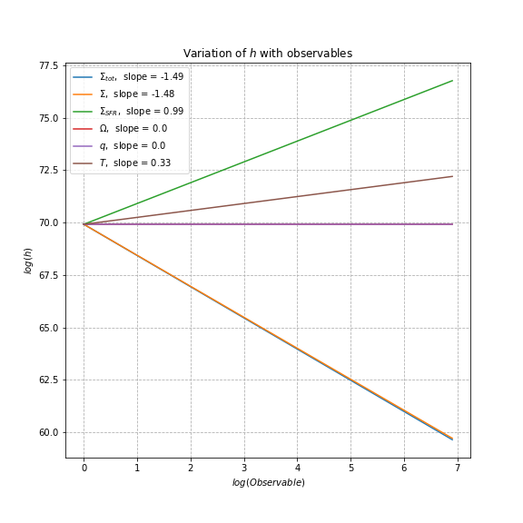
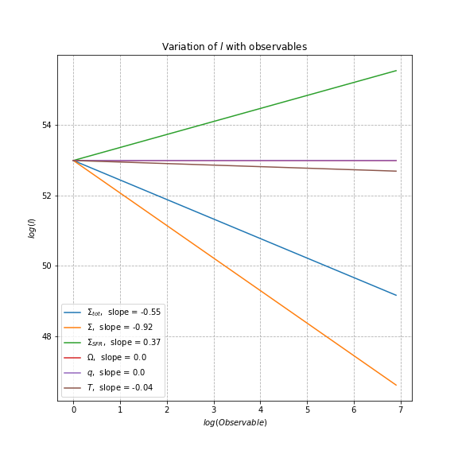
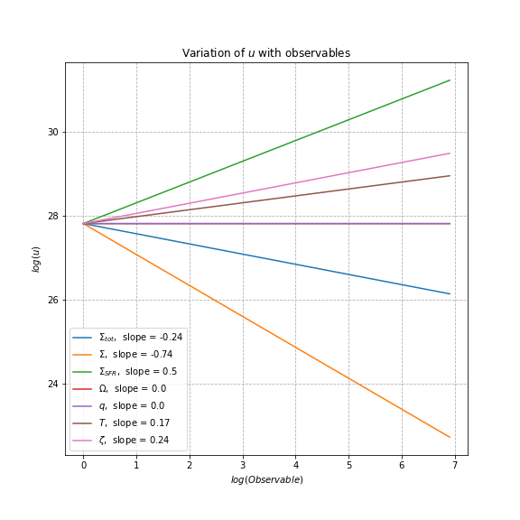
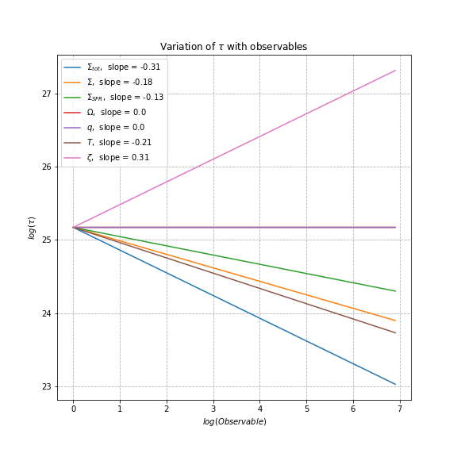
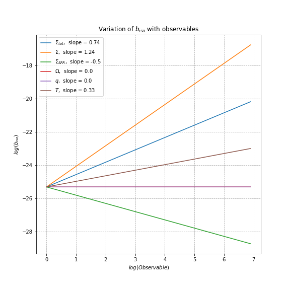
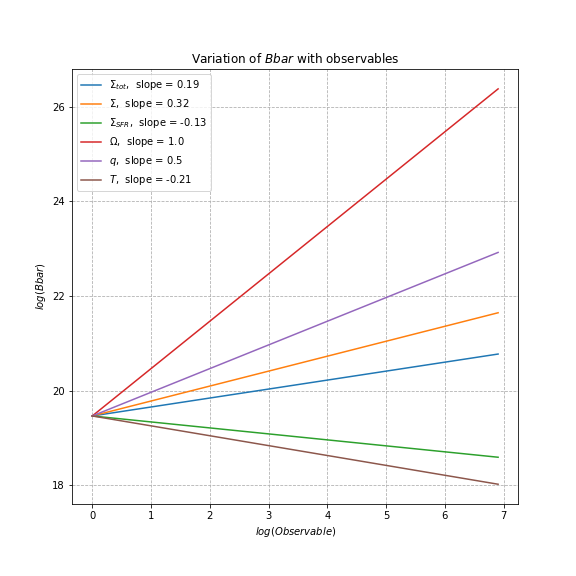
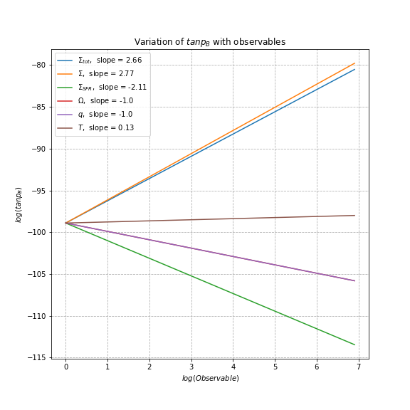

  
 Scale Height

  
  
  

  
 Correlation Length 

  
  
  

  
 Turbulent Velocity 

  
  
  

  
 Correlation time 

  
  
  

  
 Isotropic random field 

  
  
  

  
 An-isotropic random field 

  
  
  

  
 Mean magnetic field 

  
  
  

  
 Pitch angle of the mean field 

  
  
  

<blockquote>
</blockquote>
